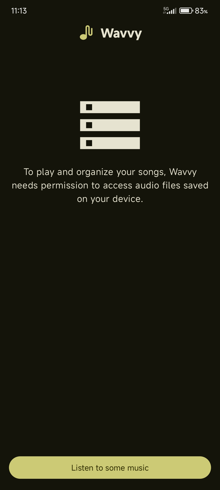
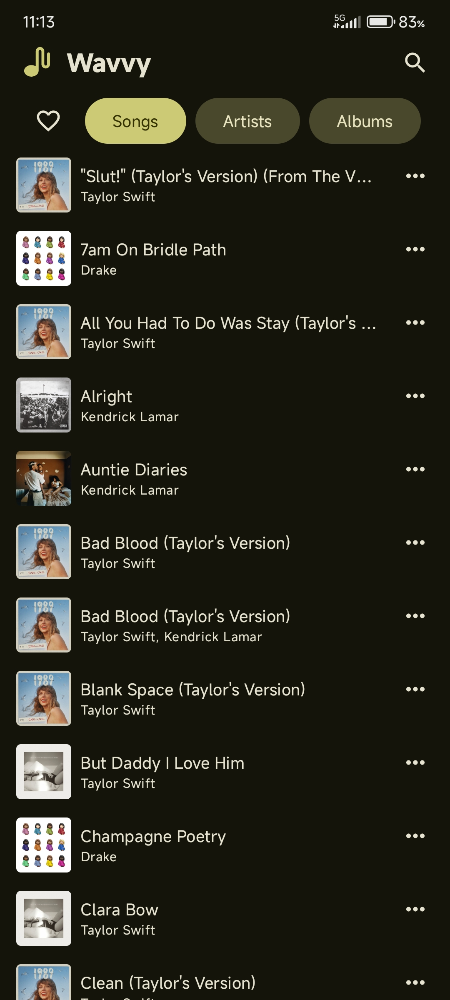
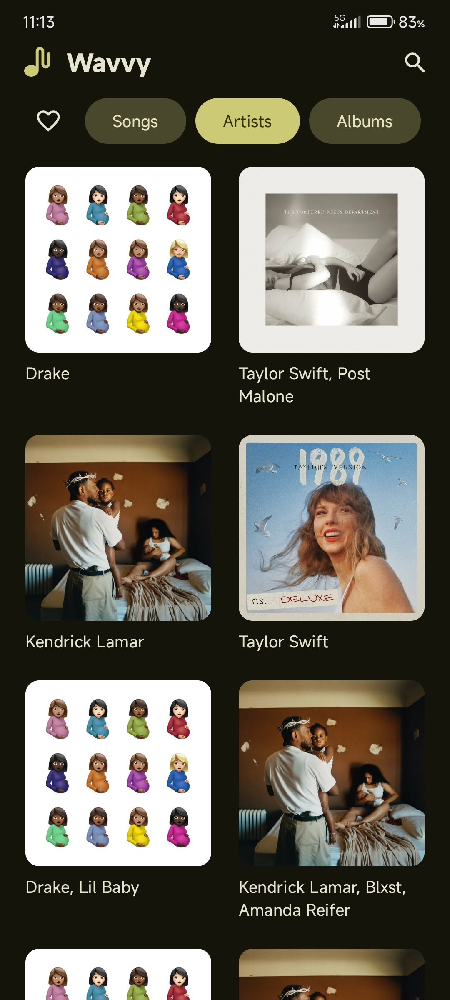
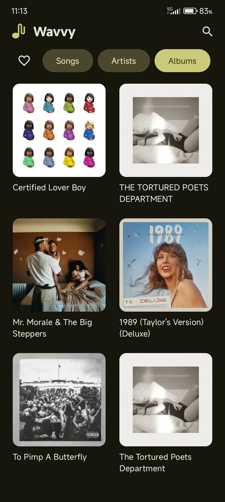
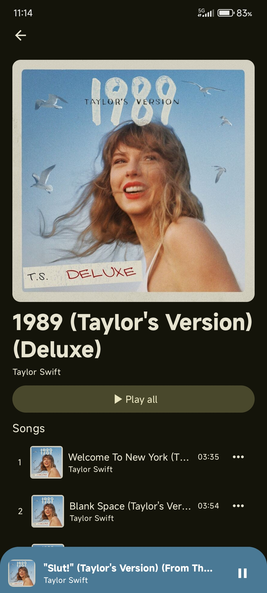
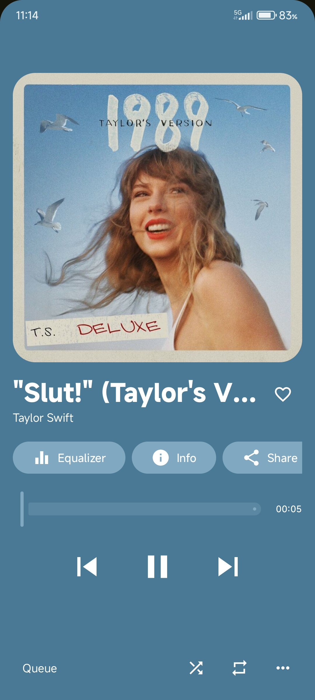
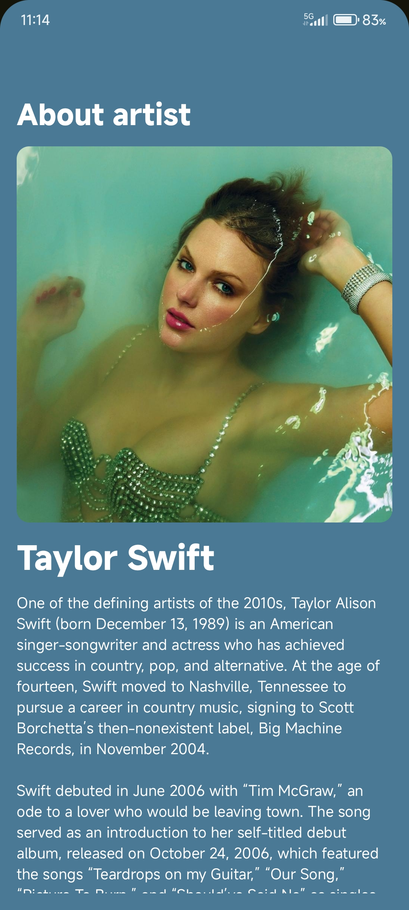
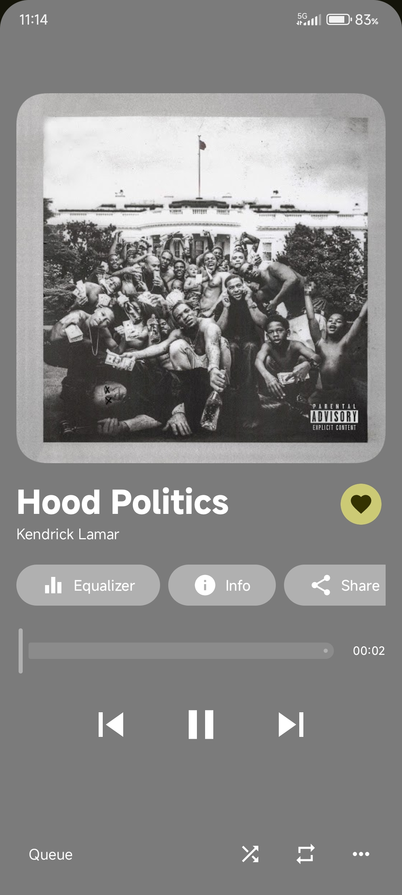
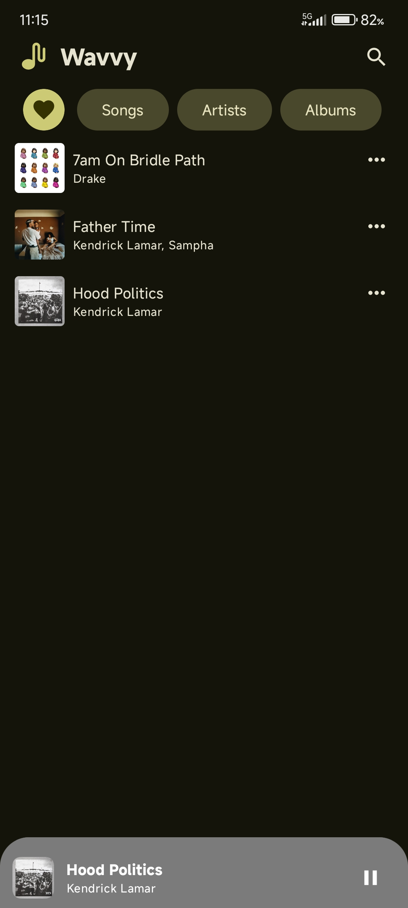
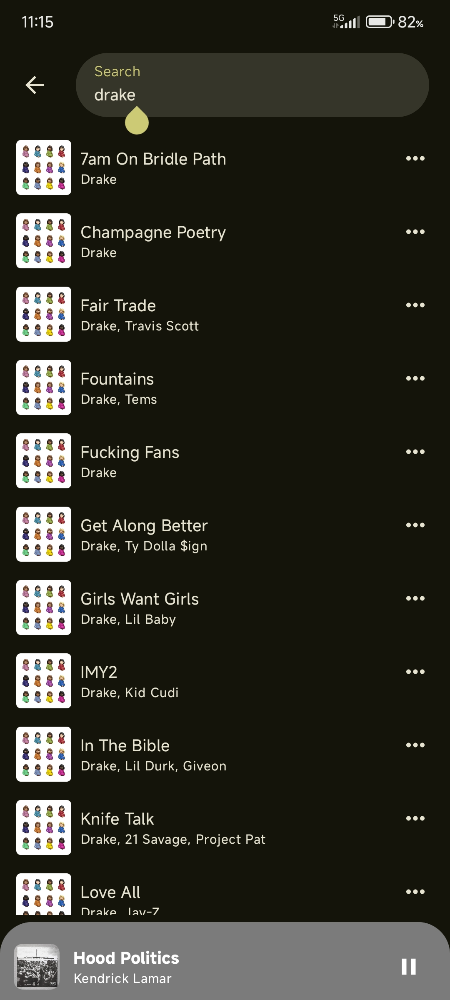

# Wavvy

An elegant Material You themed music player app

**Features**

* Media3/ExoPlayer-based
* Synced lyrics
* Material You themed
* Auto artist biography fetch
* Playlists
* Easy-to-navigate UI

|  |  | 
|-----------------------------------------------------------------------------------------------------------------------------------------------------------------------------------------------------------------------------|---------------------------------------------------------------------------------------------------------------------------------------------------------------------------------------------------------------------------------------|

## Screenshots

|  |  |  |
|---------------------|---------------------|---------------------|

|  |  |  |
|---------------------|---------------------|---------------------|

|  |  |  |
|---------------------|---------------------|---------------------|

|  |  |
|----------------------|----------------------|

## Created this for what?

I created this to test my skills and also, this is a plan I had in mind since 2yrs ago. I also
wanted to explore more of Android Development especially `Kotlin`/`Compose`.

## License

```
Wavvy
Copyright (C) 2025 Jhon Lloyd Viernes

This program is free software: you can redistribute it and/or modify
it under the terms of the GNU General Public License as published by
the Free Software Foundation, either version 3 of the License, or
(at your option) any later version.

This program is distributed in the hope that it will be useful,
but WITHOUT ANY WARRANTY; without even the implied warranty of
MERCHANTABILITY or FITNESS FOR A PARTICULAR PURPOSE.  See the
GNU General Public License for more details.

You should have received a copy of the GNU General Public License
along with this program.  If not, see <https://www.gnu.org/licenses/>.

If the program does terminal interaction, make it output a short
notice like this when it starts in an interactive mode:

    Wavvy  Copyright (C) 2025 Jhon Lloyd Viernes
    This program comes with ABSOLUTELY NO WARRANTY; for details type `show w'.
    This is free software, and you are welcome to redistribute it
    under certain conditions; type `show c' for details.

The hypothetical commands `show w' and `show c' should show the appropriate
parts of the General Public License.  Of course, your program's commands
might be different; for a GUI interface, you would use an "about box".

You should also get your employer (if you work as a programmer) or school,
if any, to sign a "copyright disclaimer" for the program, if necessary.
For more information on this, and how to apply and follow the GNU GPL, see
<https://www.gnu.org/licenses/>.

The GNU General Public License does not permit incorporating your program
into proprietary programs.  If your program is a subroutine library, you
may consider it more useful to permit linking proprietary applications with
the library.  If this is what you want to do, use the GNU Lesser General
Public License instead of this License.  But first, please read
<https://www.gnu.org/licenses/why-not-lgpl.html>.
```